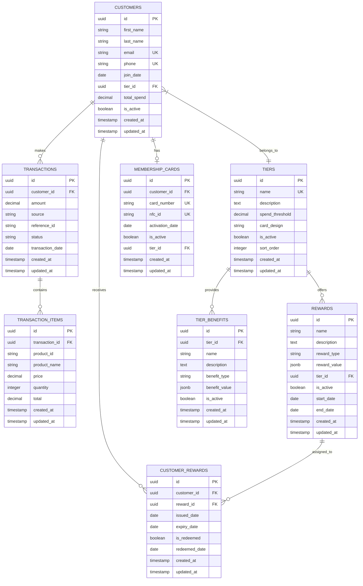

# TKO Toy Co Loyalty Program - Database Schema

## Overview

This document outlines the database schema for the TKO Toy Co Loyalty Program. The schema is designed to support the core functionality of the loyalty program, including customer management, tier-based benefits, transaction tracking, and reward management.

## Entity Relationship Diagram

## Tables

### customers

Stores information about loyalty program members.

| Column      | Type          | Constraints            | Description                              |
| ----------- | ------------- | ---------------------- | ---------------------------------------- |
| id          | UUID          | PK                     | Unique identifier                        |
| first_name  | VARCHAR(255)  | NOT NULL               | Customer's first name                    |
| last_name   | VARCHAR(255)  | NOT NULL               | Customer's last name                     |
| email       | VARCHAR(255)  | UNIQUE                 | Customer's email address                 |
| phone       | VARCHAR(50)   | NOT NULL, UNIQUE       | Customer's phone number                  |
| join_date   | DATE          | NOT NULL               | Date customer joined the loyalty program |
| tier_id     | UUID          | FK, NOT NULL           | Reference to tier                        |
| total_spend | DECIMAL(10,2) | NOT NULL, DEFAULT 0    | Total amount spent by customer           |
| is_active   | BOOLEAN       | NOT NULL, DEFAULT true | Whether customer is active               |
| created_at  | TIMESTAMP     | NOT NULL               | Record creation timestamp                |
| updated_at  | TIMESTAMP     | NOT NULL               | Record update timestamp                  |

### tiers

Stores information about loyalty tiers (boxing weight classes).

| Column          | Type          | Constraints            | Description                                  |
| --------------- | ------------- | ---------------------- | -------------------------------------------- |
| id              | UUID          | PK                     | Unique identifier                            |
| name            | VARCHAR(255)  | NOT NULL, UNIQUE       | Tier name (e.g., "Flyweight", "Heavyweight") |
| description     | TEXT          |                        | Description of the tier                      |
| spend_threshold | DECIMAL(10,2) | NOT NULL               | Minimum spend to qualify for tier            |
| card_design     | VARCHAR(255)  |                        | Path or reference to card design             |
| is_active       | BOOLEAN       | NOT NULL, DEFAULT true | Whether tier is active                       |
| sort_order      | INTEGER       | NOT NULL               | Order for display purposes                   |
| created_at      | TIMESTAMP     | NOT NULL               | Record creation timestamp                    |
| updated_at      | TIMESTAMP     | NOT NULL               | Record update timestamp                      |

### tier_benefits

Stores benefits associated with each tier.

| Column        | Type         | Constraints            | Description                                                |
| ------------- | ------------ | ---------------------- | ---------------------------------------------------------- |
| id            | UUID         | PK                     | Unique identifier                                          |
| tier_id       | UUID         | FK, NOT NULL           | Reference to tier                                          |
| name          | VARCHAR(255) | NOT NULL               | Benefit name                                               |
| description   | TEXT         |                        | Description of the benefit                                 |
| benefit_type  | VARCHAR(50)  | NOT NULL               | Type of benefit (discount_percentage, free_shipping, etc.) |
| benefit_value | JSONB        | NOT NULL               | Structured data for benefit details                        |
| is_active     | BOOLEAN      | NOT NULL, DEFAULT true | Whether benefit is active                                  |
| created_at    | TIMESTAMP    | NOT NULL               | Record creation timestamp                                  |
| updated_at    | TIMESTAMP    | NOT NULL               | Record update timestamp                                    |

### transactions

Stores customer purchase transactions.

| Column           | Type          | Constraints  | Description                                      |
| ---------------- | ------------- | ------------ | ------------------------------------------------ |
| id               | UUID          | PK           | Unique identifier                                |
| customer_id      | UUID          | FK, NOT NULL | Reference to customer                            |
| amount           | DECIMAL(10,2) | NOT NULL     | Total transaction amount                         |
| source           | VARCHAR(50)   | NOT NULL     | Transaction source (shopify, pos_binder, manual) |
| reference_id     | VARCHAR(255)  | NOT NULL     | External reference ID                            |
| status           | VARCHAR(50)   | NOT NULL     | Transaction status                               |
| transaction_date | DATE          | NOT NULL     | Date of transaction                              |
| created_at       | TIMESTAMP     | NOT NULL     | Record creation timestamp                        |
| updated_at       | TIMESTAMP     | NOT NULL     | Record update timestamp                          |

### transaction_items

Stores line items for transactions.

| Column         | Type          | Constraints  | Description                     |
| -------------- | ------------- | ------------ | ------------------------------- |
| id             | UUID          | PK           | Unique identifier               |
| transaction_id | UUID          | FK, NOT NULL | Reference to transaction        |
| product_id     | VARCHAR(255)  | NOT NULL     | External product identifier     |
| product_name   | VARCHAR(255)  | NOT NULL     | Product name                    |
| price          | DECIMAL(10,2) | NOT NULL     | Unit price                      |
| quantity       | INTEGER       | NOT NULL     | Quantity purchased              |
| total          | DECIMAL(10,2) | NOT NULL     | Total price (price \* quantity) |
| created_at     | TIMESTAMP     | NOT NULL     | Record creation timestamp       |
| updated_at     | TIMESTAMP     | NOT NULL     | Record update timestamp         |

### rewards

Stores rewards that can be assigned to customers.

| Column       | Type         | Constraints            | Description                                        |
| ------------ | ------------ | ---------------------- | -------------------------------------------------- |
| id           | UUID         | PK                     | Unique identifier                                  |
| name         | VARCHAR(255) | NOT NULL               | Reward name                                        |
| description  | TEXT         |                        | Description of the reward                          |
| reward_type  | VARCHAR(50)  | NOT NULL               | Type of reward (discount_code, free_product, etc.) |
| reward_value | JSONB        | NOT NULL               | Structured data for reward details                 |
| tier_id      | UUID         | FK, NOT NULL           | Minimum tier required for reward                   |
| is_active    | BOOLEAN      | NOT NULL, DEFAULT true | Whether reward is active                           |
| start_date   | DATE         |                        | Start date for reward availability                 |
| end_date     | DATE         |                        | End date for reward availability                   |
| created_at   | TIMESTAMP    | NOT NULL               | Record creation timestamp                          |
| updated_at   | TIMESTAMP    | NOT NULL               | Record update timestamp                            |

### customer_rewards

Stores rewards assigned to specific customers.

| Column        | Type      | Constraints             | Description                      |
| ------------- | --------- | ----------------------- | -------------------------------- |
| id            | UUID      | PK                      | Unique identifier                |
| customer_id   | UUID      | FK, NOT NULL            | Reference to customer            |
| reward_id     | UUID      | FK, NOT NULL            | Reference to reward              |
| issued_date   | DATE      | NOT NULL                | Date reward was issued           |
| expiry_date   | DATE      |                         | Date reward expires              |
| is_redeemed   | BOOLEAN   | NOT NULL, DEFAULT false | Whether reward has been redeemed |
| redeemed_date | DATE      |                         | Date reward was redeemed         |
| created_at    | TIMESTAMP | NOT NULL                | Record creation timestamp        |
| updated_at    | TIMESTAMP | NOT NULL                | Record update timestamp          |

### membership_cards

Stores physical membership cards for customers.

| Column          | Type         | Constraints             | Description               |
| --------------- | ------------ | ----------------------- | ------------------------- |
| id              | UUID         | PK                      | Unique identifier         |
| customer_id     | UUID         | FK, NOT NULL            | Reference to customer     |
| card_number     | VARCHAR(255) | NOT NULL, UNIQUE        | Card number               |
| nfc_id          | VARCHAR(255) | UNIQUE                  | NFC identifier            |
| activation_date | DATE         |                         | Date card was activated   |
| is_active       | BOOLEAN      | NOT NULL, DEFAULT false | Whether card is active    |
| tier_id         | UUID         | FK, NOT NULL            | Reference to tier         |
| created_at      | TIMESTAMP    | NOT NULL                | Record creation timestamp |
| updated_at      | TIMESTAMP    | NOT NULL                | Record update timestamp   |

## Indexes

- `customers_email_idx`: Index on `customers.email` for email lookups
- `customers_phone_idx`: Index on `customers.phone` for phone lookups
- `customers_tier_id_idx`: Index on `customers.tier_id` for tier-based queries
- `transactions_customer_id_idx`: Index on `transactions.customer_id` for customer transaction history
- `transactions_transaction_date_idx`: Index on `transactions.transaction_date` for date-based queries
- `transaction_items_transaction_id_idx`: Index on `transaction_items.transaction_id` for transaction item lookups
- `tier_benefits_tier_id_idx`: Index on `tier_benefits.tier_id` for tier benefit lookups
- `rewards_tier_id_idx`: Index on `rewards.tier_id` for tier-based reward queries
- `customer_rewards_customer_id_idx`: Index on `customer_rewards.customer_id` for customer reward lookups
- `customer_rewards_reward_id_idx`: Index on `customer_rewards.reward_id` for reward-based queries
- `membership_cards_customer_id_idx`: Index on `membership_cards.customer_id` for customer card lookups
- `membership_cards_card_number_idx`: Index on `membership_cards.card_number` for card number lookups
- `membership_cards_nfc_id_idx`: Index on `membership_cards.nfc_id` for NFC ID lookups

## Constraints

- Foreign key constraints between related tables
- Unique constraints on email, phone, card_number, and nfc_id
- Not null constraints on required fields
- Default values for boolean fields and total_spend

## Notes

- All tables use UUID primary keys for better distribution and security
- Timestamps (created_at, updated_at) are automatically managed by Sequelize
- JSONB fields (benefit_value, reward_value) allow for flexible structured data
- Soft deletion is not implemented in the initial schema but could be added with an `is_deleted` flag if needed
