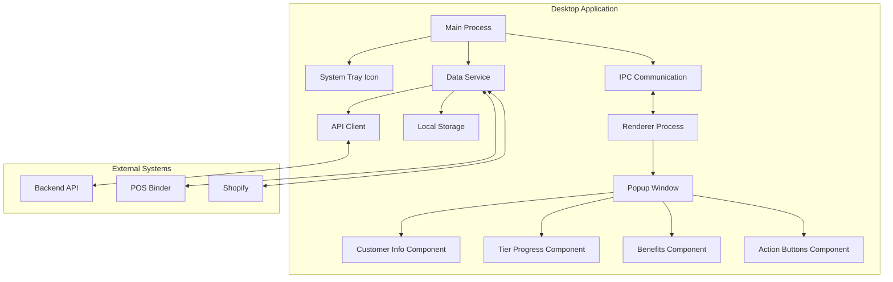

# Desktop Application Technical Approach

This document outlines the technical approach for implementing the TKO Toy Co Loyalty Program desktop application, which will provide a popup interface for customer loyalty information when a customer is looked up in POS Binder or Shopify.

## Architecture Overview

## Technology Stack

1. **Electron Framework**
   - Provides cross-platform desktop application capabilities
   - Enables system tray integration
   - Manages main and renderer processes
   - Handles window management and IPC communication

2. **React + TypeScript**
   - Frontend UI components
   - Type-safe development
   - Component-based architecture
   - Reuse of existing frontend components

3. **Electron Store**
   - Persistent storage for application settings
   - Caching of customer data for offline use
   - Secure storage of API credentials

4. **Material-UI**
   - Consistent UI components matching the main application
   - Responsive design
   - TKO branding theme

5. **Axios**
   - API communication
   - Request/response interceptors
   - Error handling

## Implementation Phases

### Phase 1: Standalone Application with Mock Data

1. **Application Shell**
   - Create Electron application structure
   - Implement system tray icon and menu
   - Set up main and renderer processes
   - Configure auto-launch and startup settings
   - Implement window management

2. **UI Components**
   - Create popup window layout
   - Implement customer information display
   - Build tier progress visualization
   - Create benefits list component
   - Implement action buttons
   - Add animations and transitions

3. **Mock Data Service**
   - Create service interfaces
   - Implement mock data providers
   - Set up local storage for settings
   - Create customer lookup functionality

4. **Manual Lookup**
   - Implement search by phone number
   - Create keyboard shortcuts for quick access
   - Add recent lookups history

### Phase 2: API Integration

1. **API Client**
   - Implement authentication
   - Create customer data service
   - Set up tier and benefit services
   - Add error handling and retry logic

2. **Data Synchronization**
   - Implement background sync
   - Add offline support with local caching
   - Create conflict resolution strategies
   - Set up sync scheduling

3. **Real-time Updates**
   - Implement WebSocket connection for live updates
   - Add notification system for changes
   - Create event handlers for customer updates

4. **Enhanced Features**
   - Implement tier progression calculations
   - Add "close to next tier" detection
   - Create suggested products/spending recommendations
   - Implement benefit application tracking

### Phase 3: POS/Shopify Integration

1. **POS Binder Integration**
   - Research POS Binder API capabilities
   - Implement customer lookup event listeners
   - Create transaction tracking
   - Add discount application functionality

2. **Shopify Integration**
   - Implement Shopify Admin API connection
   - Create customer identification
   - Add order tracking
   - Implement discount application

3. **Automated Workflows**
   - Create automatic popup triggering
   - Implement discount application automation
   - Add transaction completion handlers
   - Create tier update notifications

## Technical Considerations

### 1. Cross-Platform Compatibility

- The application should run on Windows and macOS
- Consider platform-specific behaviors for system tray
- Handle auto-launch differently per platform
- Test on both platforms throughout development

### 2. Performance Optimization

- Minimize startup time
- Optimize popup rendering speed
- Implement efficient data caching
- Use lazy loading for components
- Optimize API requests with batching and caching

### 3. Offline Functionality

- Cache customer data for offline use
- Queue changes for sync when online
- Provide clear offline indicators
- Implement sync status visualization
- Handle conflict resolution for offline changes

### 4. Security Considerations

- Secure storage of API credentials
- Implement proper authentication
- Encrypt sensitive data in local storage
- Follow principle of least privilege
- Regular security audits

### 5. User Experience

- Fast and responsive UI
- Clear visual feedback for actions
- Consistent branding with main application
- Intuitive keyboard shortcuts
- Minimal disruption to checkout flow

## Development Approach

### 1. Project Setup

- Initialize Electron project with TypeScript
- Set up React for renderer process
- Configure build and packaging
- Implement development tools and debugging
- Create CI/CD pipeline

### 2. Component Development

- Create reusable UI components
- Implement state management
- Build service layer with interfaces
- Create mock data providers
- Develop main process functionality

### 3. Testing Strategy

- Unit tests for business logic
- Component tests for UI
- Integration tests for API communication
- End-to-end tests for critical flows
- Manual testing on target platforms

### 4. Deployment Strategy

- Create installers for Windows and macOS
- Implement auto-update functionality
- Set up crash reporting
- Create deployment pipeline
- Document installation and setup process

## Next Steps

1. **Initial Setup**
   - Create Electron project structure
   - Set up React and TypeScript
   - Implement basic main process
   - Create system tray icon

2. **UI Prototype**
   - Implement popup window
   - Create basic UI components
   - Add mock data display
   - Implement window animations

3. **Service Layer**
   - Create service interfaces
   - Implement mock data providers
   - Set up local storage
   - Create customer lookup functionality

4. **Testing and Refinement**
   - Test on target platforms
   - Gather feedback on UI and UX
   - Refine components and functionality
   - Prepare for API integration
