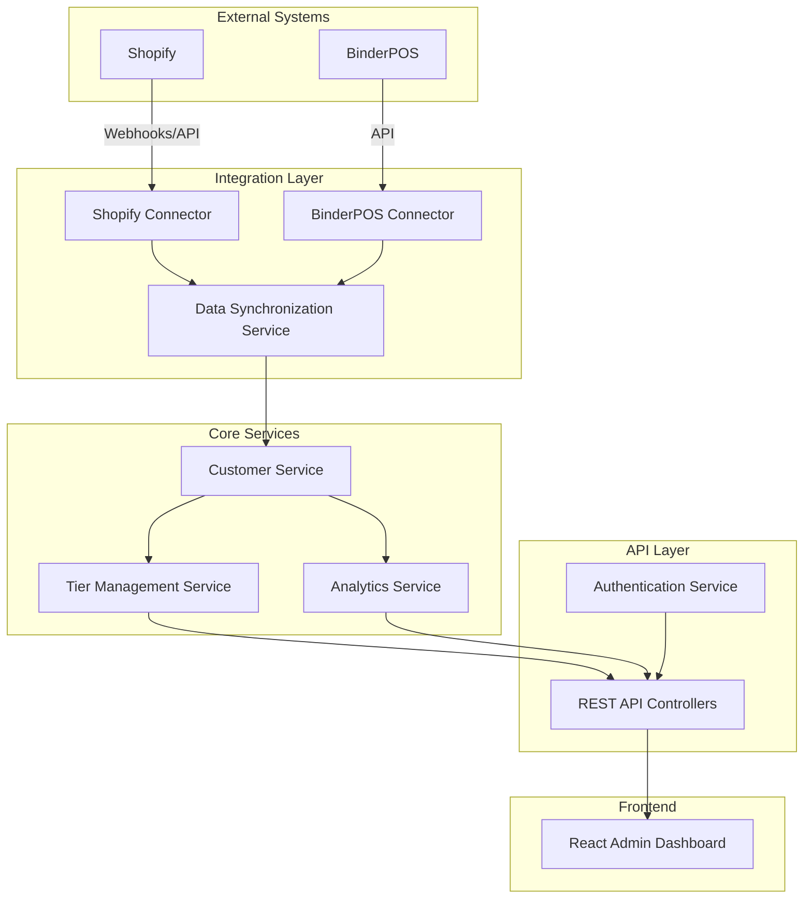

# TKO Toy Co Loyalty Program - Integration Approach

## Overview

This document evaluates the different integration approaches for the TKO Toy Co Loyalty Program application and documents the final decision. The application needs to integrate with existing systems to pull total spend data for customers, which will be used to assign customers to appropriate loyalty tiers.

## Integration Options

### 1. Standalone Application

**Description:**
A completely independent web application that connects to Shopify and BinderPOS through their APIs.

**Pros:**

- Full control over the application architecture and user experience
- Can be hosted anywhere (AWS, Azure, etc.)
- Not dependent on Shopify's app ecosystem or limitations
- Can integrate with multiple systems simultaneously (both Shopify and BinderPOS)
- Easier to extend with additional integrations in the future
- No Shopify app store approval process required

**Cons:**

- Requires separate authentication system
- Users need to switch between systems (Shopify/BinderPOS and the loyalty app)
- More complex deployment and hosting requirements
- Requires implementing and maintaining API integrations with both systems
- May require more development time initially

**Technical Implications:**

- Need to implement secure API clients for both Shopify and BinderPOS
- Requires robust error handling for API failures
- Need to implement scheduled data synchronization
- Must handle authentication and authorization independently
- Requires setting up a separate hosting environment

### 2. Shopify App

**Description:**
A Shopify app that is installed directly in the Shopify admin interface and uses Shopify's APIs for data access.

**Pros:**

- Seamless integration with Shopify admin interface
- Uses Shopify's authentication system
- Easier access to Shopify data (orders, customers, etc.)
- Simplified deployment through Shopify's app infrastructure
- Potential for distribution through Shopify App Store
- Familiar experience for Shopify users

**Cons:**

- Limited to Shopify ecosystem
- More difficult to integrate with BinderPOS for in-store purchases
- Subject to Shopify's app guidelines and limitations
- May have limitations on UI customization
- Dependent on Shopify's platform stability and changes

**Technical Implications:**

- Need to follow Shopify app development guidelines
- Must use Shopify's authentication and authorization
- Requires implementing Shopify API client
- Need to create a separate integration for BinderPOS data
- May require adapting the UI to fit within Shopify's admin interface

### 3. BinderPOS Integration

**Description:**
A module or extension that integrates directly with the BinderPOS system for in-store loyalty management.

**Pros:**

- Direct integration with the point-of-sale system
- Real-time loyalty tier application at checkout
- Seamless experience for in-store staff
- No need for separate interfaces for store employees
- Potentially faster implementation for in-store functionality

**Cons:**

- Limited to BinderPOS ecosystem
- More difficult to integrate with Shopify for online purchases
- May have limitations based on BinderPOS extension capabilities
- Less control over user experience
- Dependent on BinderPOS platform stability and changes

**Technical Implications:**

- Need to understand BinderPOS extension development
- Must adapt to BinderPOS's data structures and APIs
- Requires implementing Shopify integration separately
- May need to adapt the architecture to fit BinderPOS constraints
- Potentially limited access to frontend customization

## Final Decision: Standalone Application

After careful evaluation of all options, we have decided to implement the TKO Toy Co Loyalty Program as a **Standalone Application**. This decision is based on the following key factors:

1. **Unified Experience**: A standalone app provides a consistent interface for managing the loyalty program across both sales channels.

2. **Integration Flexibility**: Can connect to both Shopify and BinderPOS without being constrained by either platform's limitations.

3. **Future Extensibility**: Easier to add additional integrations or features in the future without being tied to a specific platform.

4. **Complete Control**: Full control over the application architecture, user experience, and deployment.

5. **Independent Development**: Can evolve independently of Shopify or BinderPOS platform changes.

6. **Compatibility with Existing Architecture**: The standalone approach aligns well with our existing Node.js/Express backend and React/TypeScript frontend architecture.

7. **Simplified Requirements**: Since the application has been simplified to focus solely on the admin dashboard and will simply pull total spend data from existing systems, a standalone approach is more appropriate than deeper platform integrations.

## Architectural Implications

### 1. Integration Architecture

- **API Integration Modules**: Create separate modules for Shopify and BinderPOS integrations in the Node.js backend

  - Shopify module will use the Shopify Admin API
  - BinderPOS module will use their available API endpoints

- **Event-Based Updates**:

  - Implement webhooks for Shopify order events to get real-time updates
  - Set up periodic data synchronization for BinderPOS if real-time webhooks aren't available

- **Authentication**:
  - Use OAuth for Shopify API authentication
  - Implement API key-based authentication for BinderPOS
  - Securely store credentials in the database with proper encryption

### 2. Data Flow Architecture

- **Data Aggregation**:

  - Backend pulls total spend data from both systems
  - Aggregates data and calculates loyalty tiers
  - Stores the aggregated data in the PostgreSQL database
  - Serves combined data to the React frontend via REST API

- **Caching Strategy**:
  - Implement Redis caching to handle API rate limits
  - Cache frequently accessed data to improve performance
  - Set appropriate TTL (Time To Live) for cached data

### 3. Security Considerations

- **API Credentials**:

  - Secure storage of API credentials in PostgreSQL with encryption
  - Implementation of OAuth flow for Shopify
  - API key management for BinderPOS
  - Environment-based configuration for different deployment environments

- **API Security**:

  - Rate limiting for external API calls
  - Comprehensive error handling and logging
  - Retry mechanisms for transient failures
  - Circuit breakers to prevent cascading failures

- **Application Security**:
  - JWT-based authentication for the admin dashboard
  - Role-based access control
  - Input validation and sanitization
  - HTTPS for all communications

### 4. Deployment Strategy

- **Infrastructure**:

  - Deploy on AWS or Azure cloud infrastructure
  - Use containerization with Docker for consistent environments
  - Implement CI/CD pipeline with GitHub Actions

- **Monitoring**:

  - Set up logging for all API interactions
  - Implement monitoring for integration health
  - Create alerts for failed synchronizations
  - Track API rate limit usage

- **Scaling**:
  - Horizontal scaling for the application tier
  - Database scaling with read replicas if needed
  - Caching layer for performance optimization

## Implementation Plan

### 1. API Integration Development

- Create Shopify integration module:

  - Implement OAuth authentication
  - Develop order data retrieval functionality
  - Set up webhook handlers for real-time updates
  - Implement customer data synchronization

- Create BinderPOS integration module:
  - Implement API key authentication
  - Develop transaction data retrieval
  - Set up scheduled synchronization
  - Implement customer data mapping

### 2. Data Synchronization Service

- Develop data aggregation logic:

  - Create customer spend calculation service
  - Implement tier assignment rules
  - Set up data consistency checks
  - Create audit logging for data changes

- Implement synchronization scheduling:
  - Set up cron jobs for regular data pulls
  - Create webhook handlers for event-based updates
  - Implement conflict resolution strategies
  - Develop error handling and retry logic

### 3. Frontend Integration

- Create API service layer in the React frontend:

  - Implement authentication token management
  - Develop API client for backend services
  - Add loading states and error handling
  - Create data caching for performance

- Update UI components to use real data:
  - Replace mock data with API calls
  - Implement proper error states
  - Add loading indicators
  - Create data refresh mechanisms

### 4. Testing and Deployment

- Develop comprehensive testing:

  - Unit tests for integration modules
  - Integration tests for API endpoints
  - End-to-end tests for critical flows
  - Performance testing for synchronization

- Set up deployment pipeline:
  - Create Docker containers for services
  - Configure CI/CD with GitHub Actions
  - Set up staging and production environments
  - Implement blue-green deployment strategy

## Next Steps

1. **Finalize API Integration Specifications**:

   - Document Shopify API endpoints and data requirements
   - Document BinderPOS API capabilities and limitations
   - Define data mapping between systems
   - Create API client specifications

2. **Develop Integration Prototypes**:

   - Create proof-of-concept for Shopify integration
   - Develop test implementation for BinderPOS connection
   - Validate data retrieval and transformation
   - Test authentication mechanisms

3. **Update Existing Architecture**:

   - Modify service interfaces to support external data
   - Update repositories for data synchronization
   - Enhance error handling for API failures
   - Implement caching strategies

4. **Create Frontend Service Layer**:
   - Develop API client services in the frontend
   - Implement authentication flow
   - Create data fetching hooks
   - Add error handling and loading states
