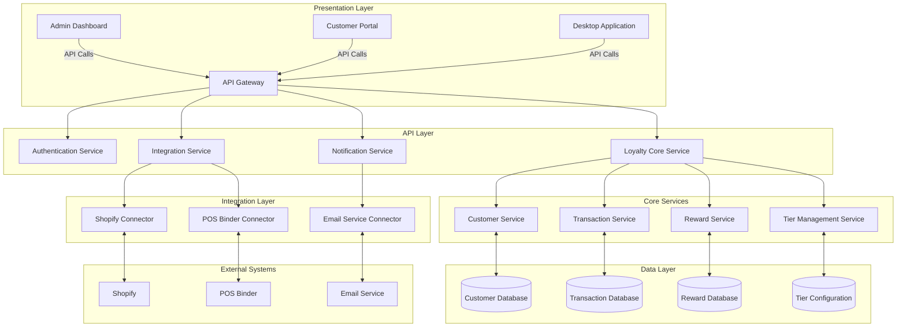
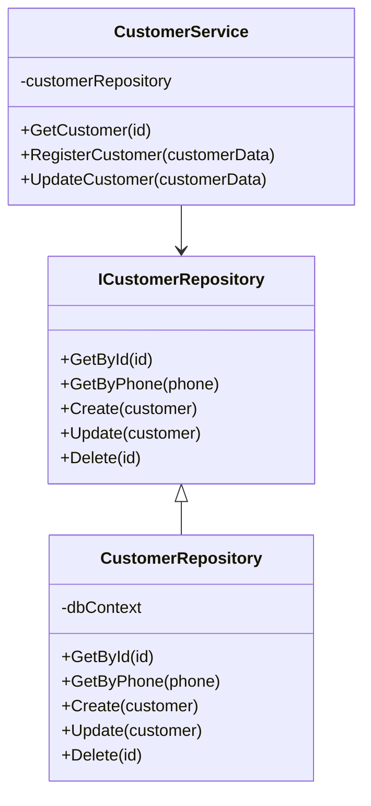
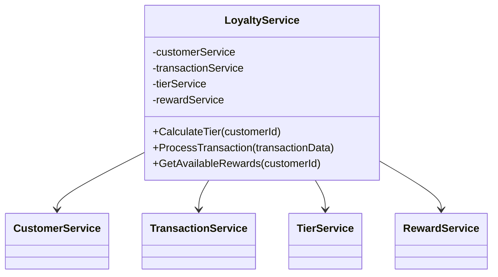
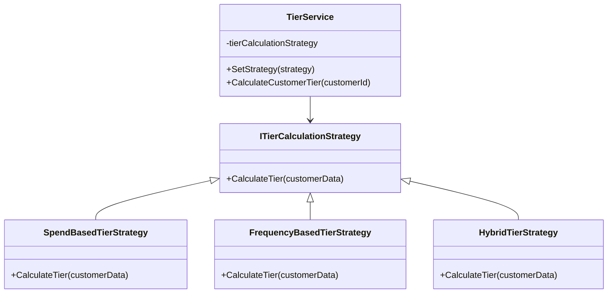
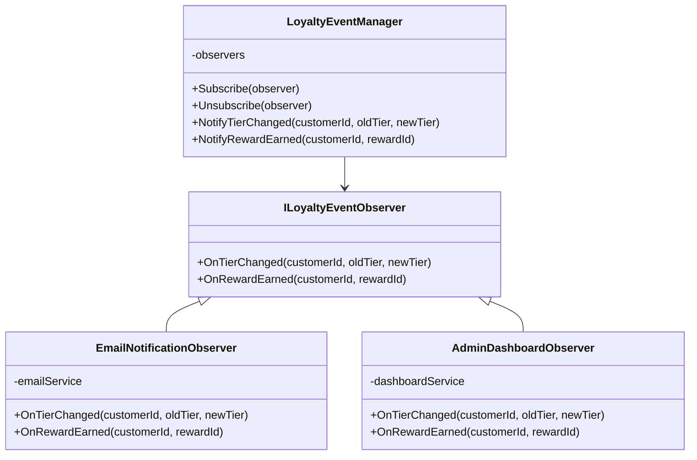
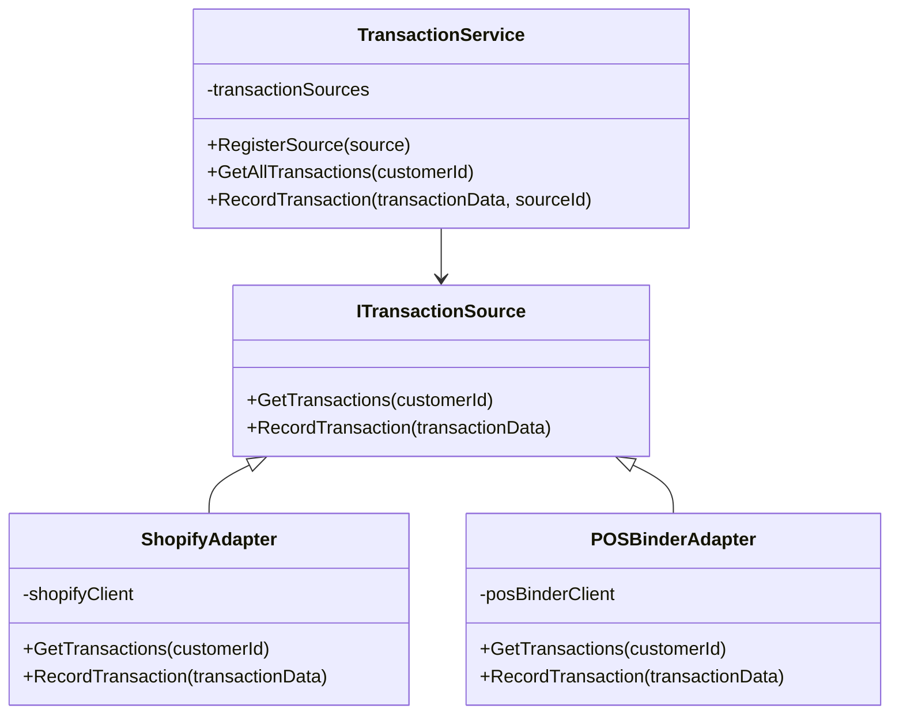
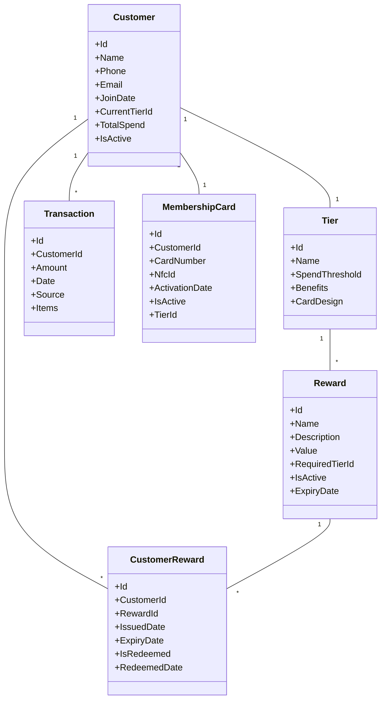
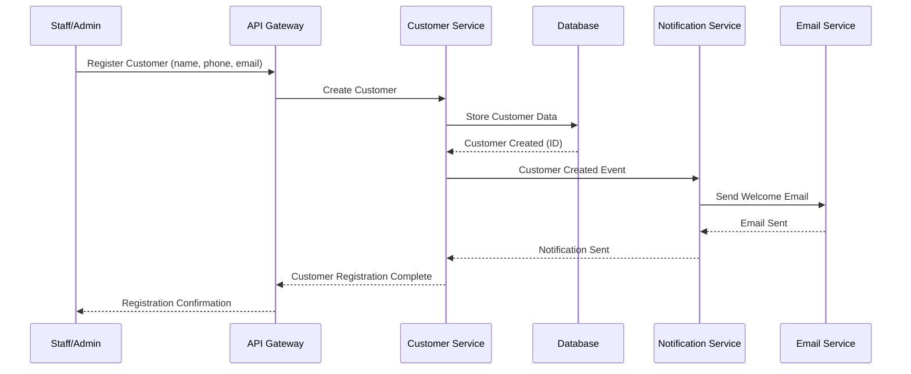
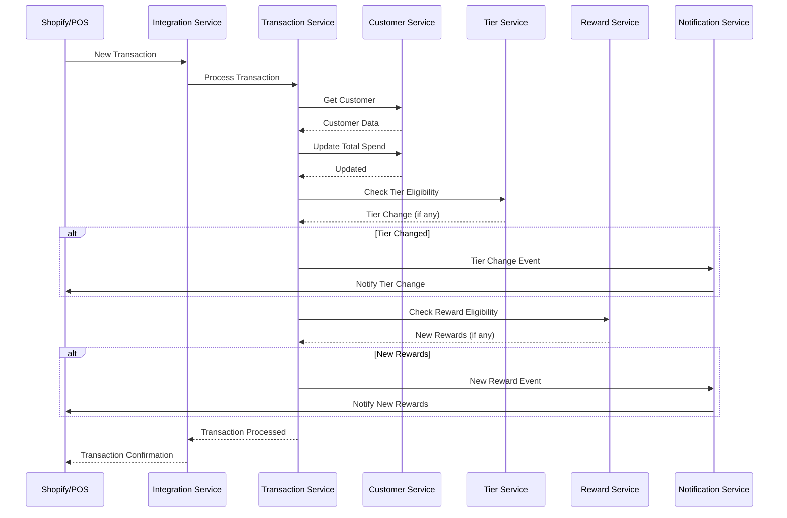
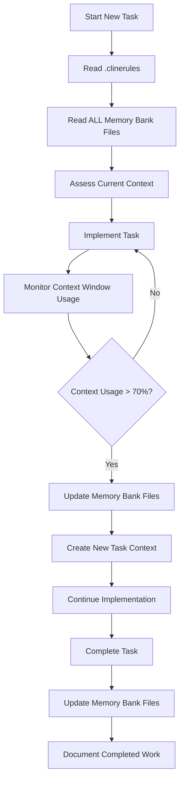

# TKO Toy Co Loyalty Program - System Patterns

**IMPORTANT: Always read .clinerules first, followed by ALL memory bank files at the start of EVERY task.**

See `memory-bank/taskWorkflow.md` for detailed task management procedures.

## System Architecture

The TKO Toy Co Loyalty Program follows a modular, service-oriented architecture to ensure flexibility, scalability, and maintainability. The system is designed to integrate with existing platforms (Shopify and POS Binder) while providing a standalone loyalty management solution.

## Key Design Patterns

### Repository Pattern

Used for data access abstraction, allowing the system to interact with the database through a consistent interface regardless of the underlying data storage technology.

### Service Pattern

Encapsulates business logic in service classes that are responsible for specific domains of functionality.

### Strategy Pattern

Used for implementing different tier calculation strategies and reward distribution algorithms.

### Observer Pattern

Implemented for notifications and event handling when customer tiers change or rewards become available.

### Adapter Pattern

Used for integrating with external systems like Shopify and POS Binder.

## Component Relationships

### Core Domain Model

## Data Flow Patterns

### Customer Registration Flow

### Transaction Processing Flow

## Critical Implementation Paths

### Integration Implementation

1. **Shopify Integration**

   - Implement Shopify API client
   - Create adapter for transaction synchronization
   - Develop webhook handlers for real-time events
   - Implement customer identification mechanism

2. **POS Binder Integration**
   - Develop POS Binder connector
   - Implement transaction import/export
   - Create customer lookup functionality
   - Develop card scanning interface

3. **Desktop Application Implementation**
   - Create Electron-based application with dual-window architecture
   - Implement system tray integration with context menu
   - Develop popup window for customer loyalty information
   - Create admin dashboard for comprehensive management
   - Implement IPC communication between main and renderer processes
   - Create service layer with repository pattern for data access
   - Implement single instance lock mechanism to prevent multiple instances

### Tier Management Implementation

1. **Tier Configuration**

   - Create tier definition interface
   - Implement tier threshold management
   - Develop tier benefit association
   - Create tier upgrade/downgrade logic

2. **Customer Tier Calculation**
   - Implement spend tracking
   - Develop tier calculation algorithms
   - Create tier change notification system
   - Implement tier history tracking

### Reward System Implementation

1. **Reward Definition**

   - Create reward management interface
   - Implement reward eligibility rules
   - Develop reward value calculation
   - Create reward activation/deactivation logic

2. **Reward Distribution**
   - Implement reward issuance system
   - Develop reward redemption process
   - Create reward expiration handling
   - Implement reward history tracking

## Technical Constraints and Considerations

1. **Performance Optimization**

   - Implement caching for frequently accessed data
   - Use database indexing for customer and transaction lookups
   - Optimize API calls to external systems
   - Implement batch processing for historical data

2. **Security Measures**

   - Implement secure API authentication
   - Encrypt sensitive customer data
   - Use secure token-based authentication for admin access
   - Implement role-based access control

3. **Scalability Considerations**

   - Design for horizontal scaling of services
   - Implement database sharding strategy for large customer bases
   - Use message queues for asynchronous processing
   - Design for multi-region deployment

4. **Resilience Patterns**
   - Implement circuit breakers for external service calls
   - Develop retry mechanisms for transient failures
   - Create fallback strategies for critical operations
   - Implement comprehensive logging and monitoring

## Task Context Management Pattern

The Task Context Management Pattern is a critical workflow pattern used in this project to ensure consistent knowledge transfer between development sessions and to maintain context across the development lifecycle.

### Key Components

1. **Context Initialization**

   - Always read `.clinerules` first at the start of every task
   - Read ALL memory bank files in a specific order
   - Assess current project state and recent changes

2. **Context Monitoring**

   - Regularly check context window usage percentage
   - Create new task contexts at logical boundaries
   - Proactively manage context when usage exceeds 70-80%

3. **Context Preservation**

   - Update memory bank files before transitions
   - Document completed work and pending items
   - Capture important decisions and patterns

4. **Context Transition**
   - Use the `new_task` tool with comprehensive context
   - Include current status, technical concepts, and next steps
   - Ensure smooth handoff between task contexts

This pattern ensures that no critical information is lost between development sessions, maintaining a consistent understanding of the project state and enabling efficient continuation of work.
