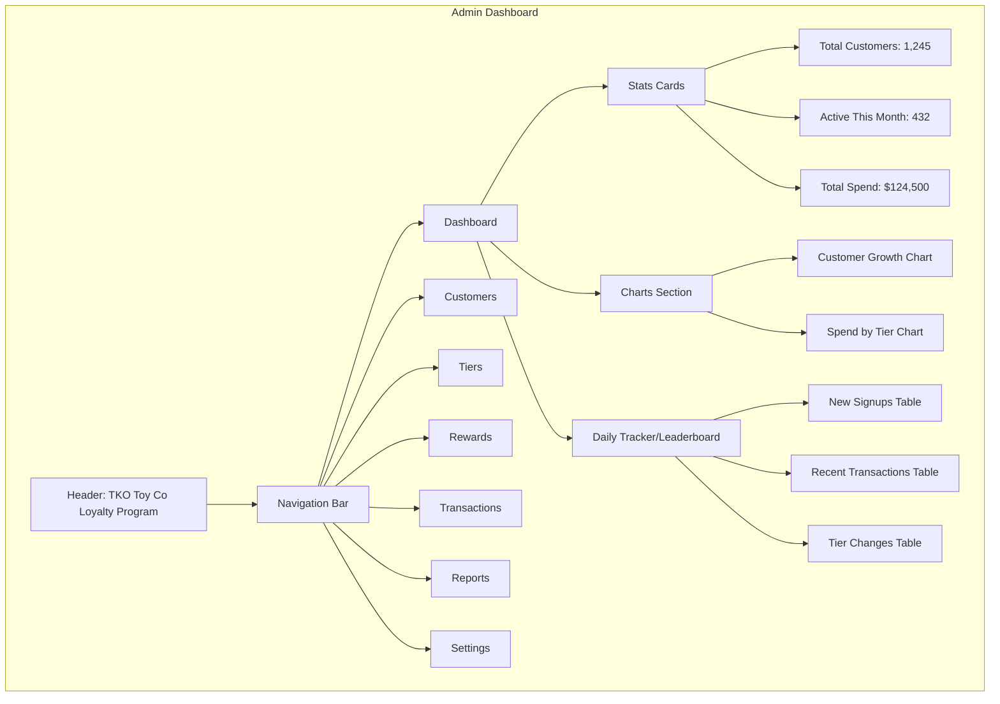

# Admin Dashboard Overview

This wireframe represents the main dashboard view for administrators of the TKO Toy Co Loyalty Program. It provides a high-level overview of key metrics and recent activity.

## Key Components

1. **Header & Navigation**

   - Program branding and main navigation menu
   - Quick access to all major sections of the admin interface

2. **Stats Cards**

   - Key metrics displayed prominently
   - Visual indicators for trends (up/down arrows)
   - Period selector (today, this week, this month, this year)

3. **Charts Section**

   - Visual representation of important program metrics
   - Interactive charts with filtering options
   - Exportable data for reporting

4. **Daily Tracker/Leaderboard**
   - Daily performance metrics with boxing theme
   - Top customers or most active users
   - Recent program activity (signups, transactions, tier changes)
   - Clickable entries for detailed views

## User Interactions

- Administrators can click on any metric to see detailed breakdowns
- Charts are interactive with hover tooltips and click-through for details
- Daily tracker/leaderboard entries link to the relevant detailed views (customer profiles, transaction details, etc.)
- Navigation items highlight the current section and provide dropdown menus for subsections

## Boxing Theme Integration

The loyalty program will follow a boxing theme, with loyalty tiers named after boxing weight classes.

### Original Eight Weight Classes (Traditional/Classic Divisions)

These are the most prominent and widely recognized weight divisions in boxing:

1. **Flyweight**: 108-112 lbs (49-50.8 kg)
2. **Bantamweight**: 115-118 lbs (52.2-53.5 kg)
3. **Featherweight**: 122-126 lbs (55.3-57.2 kg)
4. **Lightweight**: 130-135 lbs (59-61.2 kg)
5. **Welterweight**: 140-147 lbs (63.5-66.7 kg)
6. **Middleweight**: 154-160 lbs (69.9-72.6 kg)
7. **Light Heavyweight**: 168-175 lbs (76.2-79.4 kg)
8. **Heavyweight**: 200+ lbs (90.7+ kg)

### Additional Weight Classes

These divisions were added later to create more championship opportunities:

1. **Strawweight**: 105 lbs (47.6 kg)
2. **Light Flyweight**: 105-108 lbs (47.6-49 kg)
3. **Super Flyweight**: 112-115 lbs (50.8-52.2 kg)
4. **Super Bantamweight**: 118-122 lbs (53.5-55.3 kg)
5. **Super Featherweight**: 126-130 lbs (57.2-59 kg)
6. **Light Welterweight**: 135-140 lbs (61.2-63.5 kg)
7. **Light Middleweight**: 147-154 lbs (66.7-69.9 kg)
8. **Super Middleweight**: 160-168 lbs (72.6-76.2 kg)
9. **Cruiserweight**: 175-200 lbs (79.4-90.7 kg)
10. **Bridgerweight**: 200-224 lbs (90.7-101.6 kg)

The program will select appropriate weight classes from this list to serve as loyalty tiers. This theme will be reflected in the visual design, terminology, and gamification elements throughout the admin dashboard and customer-facing interfaces. The dashboard will incorporate boxing-themed elements in its metrics, charts, and activity tracking to maintain thematic consistency.
