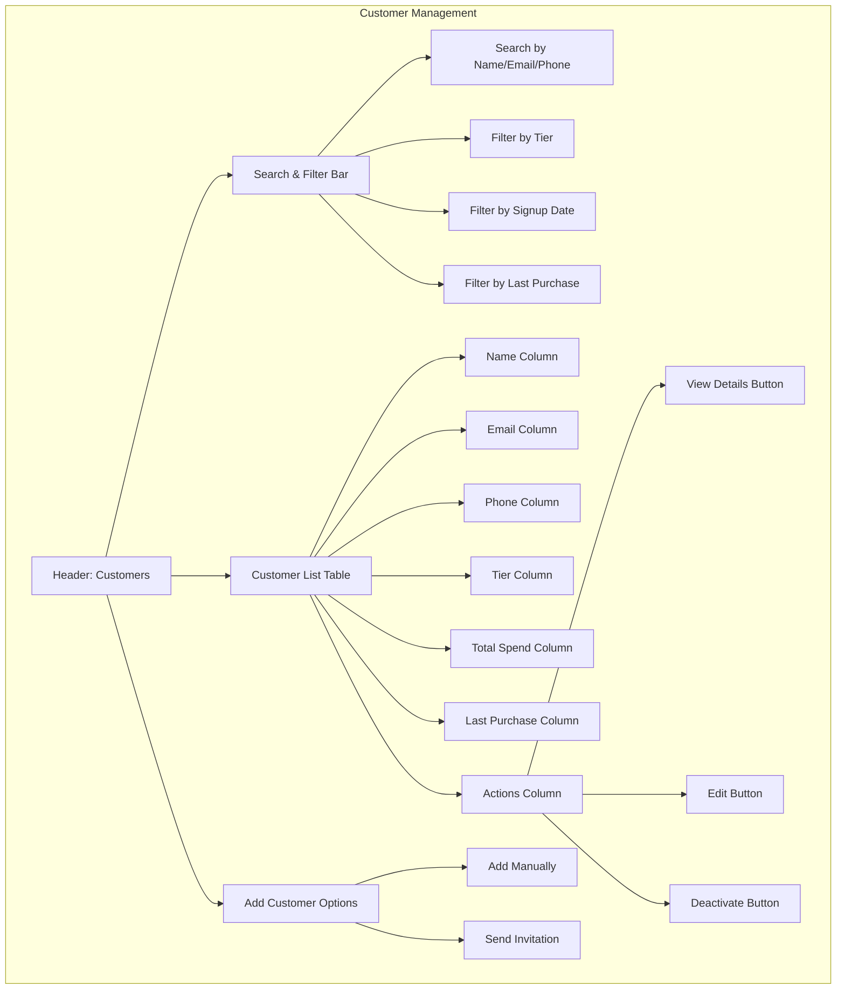

# Customer Management Interface

This wireframe represents the customer management interface for the TKO Toy Co Loyalty Program. It provides administrators with tools to search, filter, and manage customer accounts.

## Key Components

1. **Search & Filter Bar**

   - Comprehensive search functionality across multiple customer fields
   - Advanced filtering options to narrow down customer lists
   - Savable filter presets for common searches
   - Column sorting (ascending/descending) for all data fields

2. **Customer List Table**

   - Sortable columns for easy data organization
   - Pagination for handling large customer databases
   - Visual indicators for tier status (color coding, icons)
   - Quick view of essential customer information
   - Customizable columns based on business priorities and information importance

3. **Action Buttons**

   - Contextual actions for each customer record
   - Permissions-based visibility of sensitive actions
   - Confirmation dialogs for destructive actions
   - Quick access to edit customer information when needed

4. **Add Customer Options**
   - Two methods for adding new customers:
     - **Add Manually**: Opens a modal form with all required fields for staff to enter customer information
     - **Send Invitation**: Allows sending an email or SMS invitation for customers to self-register and provide their own details
   - Validation to ensure data quality
   - Tracking of invitation status (sent, opened, completed)

## User Interactions

- Administrators can search for customers using partial matches
- Clicking column headers sorts the table by that column (ascending/descending)
- Hovering over tier icons shows tier benefits summary
- Clicking "View Details" navigates to the customer detail view
- "Edit" button opens an inline or modal edit form
- "Deactivate" button requires confirmation and reason selection
- "Add Manually" opens a multi-step form with validation
- "Send Invitation" opens a form to enter customer email or phone number for self-registration
