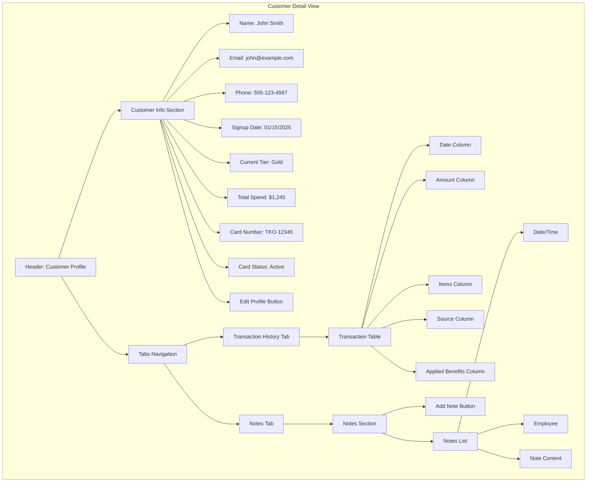

# Customer Detail View

This wireframe represents the detailed view of an individual customer in the TKO Toy Co Loyalty Program. It provides comprehensive information about the customer, their transaction history, and other relevant details.

## Key Components

1. **Customer Info Section**

   - Essential customer information displayed prominently and editable
   - Visual indicator of loyalty tier (with boxing-themed color coding)
   - Physical card information integrated directly in the main view
   - Summary of key metrics (total spend, visit frequency)
   - Edit button to modify customer details

2. **Tabs Navigation**

   - Organized sections for different aspects of customer data
   - Maintains clean interface while providing comprehensive information
   - Tab state persists between visits to the customer profile

3. **Transaction History**

   - Complete record of customer purchases
   - Sortable and filterable table
   - Links to detailed transaction records
   - Export functionality for reporting
   - "Applied Benefits" column showing tier benefits applied to each transaction

4. **Notes Section**
   - Internal notes about the customer
   - Communication history
   - Special considerations or preferences
   - Tagged notes for easy filtering
   - Timestamp and employee attribution for each note

## User Interactions

- Administrators can edit customer information via the Edit Profile button
- Tabs switch between different sections of customer data
- Transaction history can be filtered by date range, amount, or source
- Card status can be updated directly from the main customer info section
- Notes can be added, edited, or categorized with tags
- Tier benefits are automatically displayed based on the customer's current tier

## Tier Benefits Display

The customer's current tier (e.g., "Gold" corresponding to a boxing weight class) is prominently displayed with visual indicators. When staff access a customer's profile:

1. The tier is clearly shown with appropriate boxing-themed styling
2. A tooltip or expandable section shows the specific benefits associated with that tier
3. During transaction processing, these benefits are automatically suggested for application
4. The transaction history shows which benefits were applied to past purchases
