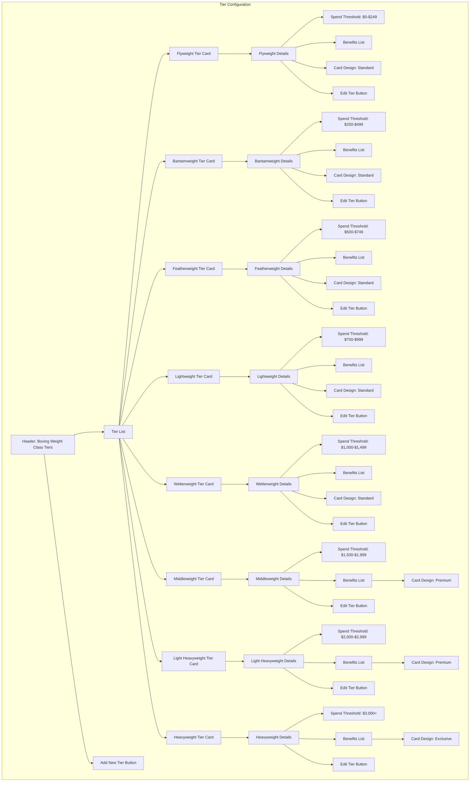

# Tier Configuration Interface

This wireframe represents the tier configuration interface for the TKO Toy Co Loyalty Program. It allows administrators to define and manage the different loyalty tiers, their spending thresholds, and associated benefits.

## Key Components

1. **Tier List**

   - Visual representation of all loyalty tiers using boxing weight classes
   - Hierarchical display showing progression from lightest to heaviest
   - Boxing-themed color coding for easy identification
   - Drag-and-drop reordering capability

2. **Tier Cards**

   - Individual cards for each boxing weight class tier
   - Clear display of tier name and spending thresholds
   - Visual indicators of tier status (active/inactive)
   - Card design preview (Standard, Premium, Exclusive)
   - Expandable/collapsible for detailed view

3. **Tier Details**

   - Spending threshold configuration
   - List of associated benefits and rewards
   - Performance metrics for each tier
   - Customer distribution statistics
   - Physical card design assignment

4. **Edit Controls**
   - Edit buttons for modifying tier properties
   - Ability to activate/deactivate tiers
   - Option to add new tiers to the program
   - Confirmation for changes that affect existing customers

## User Interactions

- Administrators can expand/collapse tier cards to view details
- Clicking "Edit Tier" opens a modal with all configurable properties
- Benefits can be added, removed, or reordered within each tier
- Benefit values can be modified (e.g., changing a 10% discount to 12%)
- Spending thresholds can be adjusted with validation to prevent overlaps
- New tiers can be added with the "Add New Tier" button
- Tiers can be reordered via drag-and-drop to change their hierarchy
- Changes to tier configurations prompt warnings about impacts on existing customers

## Tier Properties

1. **Basic Properties**

   - Tier name (based on boxing weight class)
   - Description
   - Color code
   - Icon or badge
   - Spending threshold (minimum and maximum)

2. **Benefits Configuration**

   - Discount percentage (editable value)
   - Early access to new products (configurable timeframe)
   - Special event access (selectable event types)
   - Exclusive product access (product category selection)
   - Priority service options (configurable settings)

3. **Card Design Options**

   - Standard design (for lower tiers)
   - Premium design (for middle-upper tiers)
   - Exclusive design (for highest tier)
   - Custom color schemes
   - Special finishes and materials

4. **Advanced Settings**
   - Tier qualification rules (spend only, visit frequency, etc.)
   - Tier maintenance requirements
   - Downgrade policies
   - Grace period settings
   - Anniversary bonuses

## Card Design Visualization

The interface includes a visual preview of physical loyalty cards for each tier:

1. **Standard Card Design**

   - Used for the first 5 tiers (Flyweight through Welterweight)
   - Basic design with tier-specific color accents
   - Standard material

2. **Premium Card Design**

   - Used for middle-upper tiers (Middleweight and Light Heavyweight)
   - Enhanced design with premium finishes
   - Higher quality material

3. **Exclusive Card Design**
   - Used for the highest tier (Heavyweight)
   - Distinctive design with special finishes
   - Premium materials (metal or specialty plastics)
