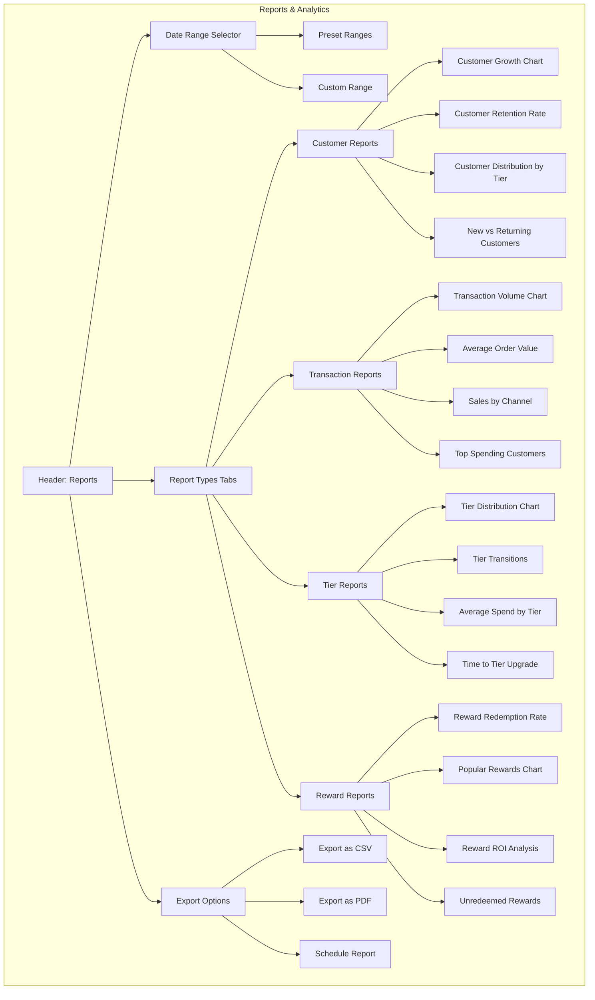

# Reports and Analytics Dashboard

This wireframe represents the reports and analytics dashboard for the TKO Toy Co Loyalty Program. It provides administrators with comprehensive insights into program performance, customer behavior, and business impact.

## Key Components

1. **Date Range Selector**

   - Flexible date range selection for all reports
   - Preset options (today, this week, this month, this quarter, this year)
   - Custom date range picker
   - Comparison period option (e.g., vs. previous period)

2. **Report Types Tabs**

   - Organized categories of reports
   - Consistent interface across report types
   - Quick switching between related metrics
   - Saved report configurations

3. **Customer Reports**

   - Growth trends over time
   - Retention and churn analysis
   - Segmentation by tier, spend, and activity
   - Customer lifetime value calculations

4. **Transaction Reports**

   - Sales volume and trends
   - Average order value analysis
   - Channel performance comparison
   - Product category insights

5. **Tier Reports**

   - Distribution of customers across tiers
   - Movement between tiers over time
   - Spending patterns by tier
   - Tier effectiveness analysis

6. **Reward Reports**

   - Redemption rates and patterns
   - Most/least popular rewards
   - Return on investment calculations
   - Expiring rewards tracking

7. **Export Options**
   - Multiple format options (CSV, PDF, Excel)
   - Scheduled report delivery
   - Customizable templates
   - Sharing capabilities

## User Interactions

- Administrators can select date ranges to analyze specific periods
- Tabs allow switching between different report categories
- Charts are interactive with hover details and drill-down capabilities
- Filters can be applied to focus on specific segments or metrics
- Reports can be saved as favorites for quick access
- Export options allow sharing reports with stakeholders
- Scheduled reports can be configured to run automatically

## Report Customization

1. **Filtering Options**

   - By customer segment
   - By tier level
   - By transaction source
   - By date range
   - By product category

2. **Visualization Types**

   - Line charts for trends over time
   - Bar charts for comparisons
   - Pie charts for distributions
   - Tables for detailed data
   - Heat maps for pattern identification

3. **Advanced Analytics**

   - Predictive tier movement
   - Customer churn risk identification
   - Reward optimization suggestions
   - Spending pattern anomaly detection
   - Program ROI calculations

4. **Saved Views**
   - Personal dashboard configurations
   - Team shared reports
   - Executive summary views
   - Operational monitoring dashboards
   - Marketing campaign analysis templates
