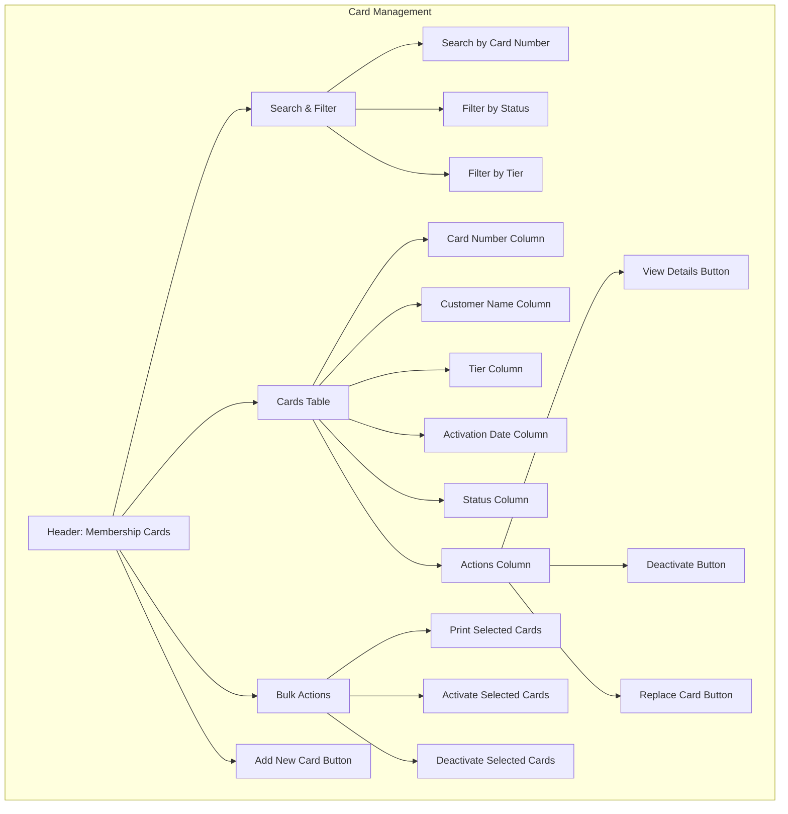

# Physical Card Management

This wireframe represents the physical card management interface for the TKO Toy Co Loyalty Program. It allows administrators to issue, track, and manage physical membership cards for customers.

## Key Components

1. **Search & Filter**

   - Quick search by card number, customer name, or ID
   - Status filters (active, inactive, lost, expired)
   - Tier filters to view cards by loyalty tier
   - Advanced filtering options for bulk management

2. **Cards Table**

   - Comprehensive list of all physical cards in the system
   - Essential information displayed in columns
   - Visual indicators for card status
   - Sortable columns for easy organization

3. **Action Buttons**

   - Contextual actions for each card
   - View details for complete card information
   - Deactivation option for lost or stolen cards
   - Replacement functionality for damaged cards

4. **Bulk Actions**

   - Tools for managing multiple cards simultaneously
   - Batch printing for new card issuance
   - Mass activation for newly issued cards
   - Bulk deactivation for expired programs or security issues

5. **Add New Card**
   - Process to issue new physical cards
   - Association with customer accounts
   - Card number generation or assignment
   - Initial activation settings

## User Interactions

- Administrators can search for specific cards using various criteria
- Clicking column headers sorts the table by that column
- "View Details" shows complete card information and history
- "Deactivate" button requires confirmation and reason selection
- "Replace Card" initiates the card replacement workflow
- Bulk actions can be performed on selected cards
- "Add New Card" starts the card issuance process

## Card Properties

1. **Basic Information**

   - Card number (unique identifier)
   - Associated customer
   - Current tier
   - Issue date
   - Expiration date (if applicable)

2. **Status Options**

   - Active: Card is in use
   - Inactive: Card has not been activated
   - Lost/Stolen: Card has been reported missing
   - Replaced: Card has been superseded by a new card
   - Expired: Card is no longer valid

3. **Card History**

   - Activation record
   - Usage history
   - Status changes
   - Replacement records
   - Associated transactions

4. **Security Features**
   - PIN or security code management
   - NFC/barcode activation status
   - Access control settings
   - Usage restrictions

## Card Operations

1. **Card Issuance**

   - Assignment to customer
   - Number generation
   - Physical printing request
   - Welcome package preparation

2. **Card Activation**

   - Verification process
   - Initial PIN setting
   - Association with loyalty account
   - Welcome notification

3. **Card Replacement**

   - Deactivation of old card
   - Transfer of benefits and history
   - New card issuance
   - Customer notification

4. **Card Deactivation**
   - Reason documentation
   - Effect on customer account
   - Recovery process (if applicable)
   - Reporting for lost/stolen cards
