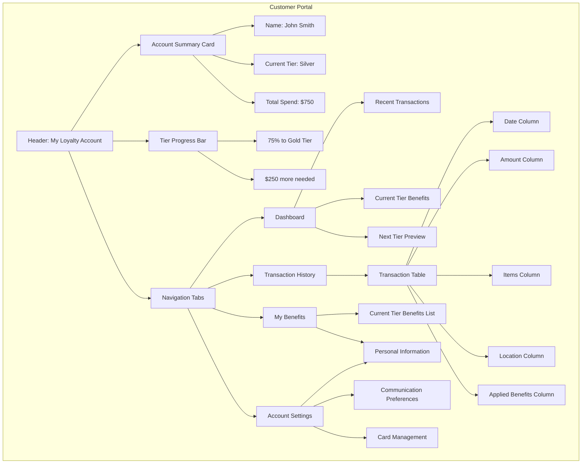

# Customer Portal (Future Phase)

This wireframe represents the customer-facing portal for the TKO Toy Co Loyalty Program. It allows customers to view their loyalty status, tier benefits, transaction history, and manage their account settings.

## Key Components

1. **Account Summary Card**

   - Essential account information displayed prominently
   - Current tier with boxing weight class visual indicator
   - Total spend to date
   - Current tier benefits indicator
   - Quick access to key actions

2. **Tier Progress Bar**

   - Visual representation of progress to next tier
   - Clear indication of spending needed for upgrade
   - Motivational messaging to encourage additional purchases
   - Comparison with current tier benefits

3. **Navigation Tabs**

   - Intuitive navigation between different sections
   - Consistent interface across the portal
   - Mobile-responsive design
   - Active state indicators

4. **Dashboard**

   - Overview of account status and recent activity
   - Overview of tier benefits
   - Current tier benefits summary
   - Personalized recommendations

5. **Transaction History**

   - Complete record of qualifying purchases
   - Sortable and filterable table
   - Receipt access for individual transactions
   - Spending patterns visualization

6. **Benefits Section**

   - Current tier benefits clearly displayed
   - Visual comparison with next tier benefits
   - Automatic application explanation
   - Boxing-themed presentation of benefits

7. **Account Settings**
   - Personal information management
   - Communication preferences
   - Physical card management
   - Privacy and security settings

## User Interactions

- Customers can view their current loyalty status and progress
- Transaction history can be filtered by date, amount, or location
- Benefits are clearly displayed with explanations of how they're automatically applied
- Account settings can be updated with proper validation
- Loyalty ID can be accessed for in-store identification
- Communication preferences can be adjusted for email, SMS, or push notifications

## Customer Experience Features

1. **Personalization**

   - Customized welcome message
   - Personalized tier benefit recommendations
   - Tailored promotional content
   - Individualized spending insights

2. **Gamification Elements**

   - Achievement badges for loyalty milestones
   - Progress visualization
   - Challenges and bonus opportunities
   - Social sharing options

3. **Educational Content**

   - Program benefit explanations
   - Tier comparison charts
   - Tier benefits guides
   - FAQ and help resources

4. **Mobile Experience**
   - Responsive design for all devices
   - Mobile-specific features (location services, push notifications)
   - Digital card for in-store scanning
   - Quick access to most common functions

## Integration Points

1. **Online Store Connection**

   - Single sign-on with e-commerce platform
   - Real-time transaction updates
   - Cart integration for tier benefits
   - Personalized product recommendations

2. **In-Store Experience**

   - Digital card display for scanning
   - Store locator with tier-specific benefits
   - Special in-store events by tier
   - Mobile check-in capabilities

3. **Communication System**
   - Email notifications for tier changes
   - SMS alerts for tier changes
   - Push notifications for special offers
   - Birthday and anniversary messages
