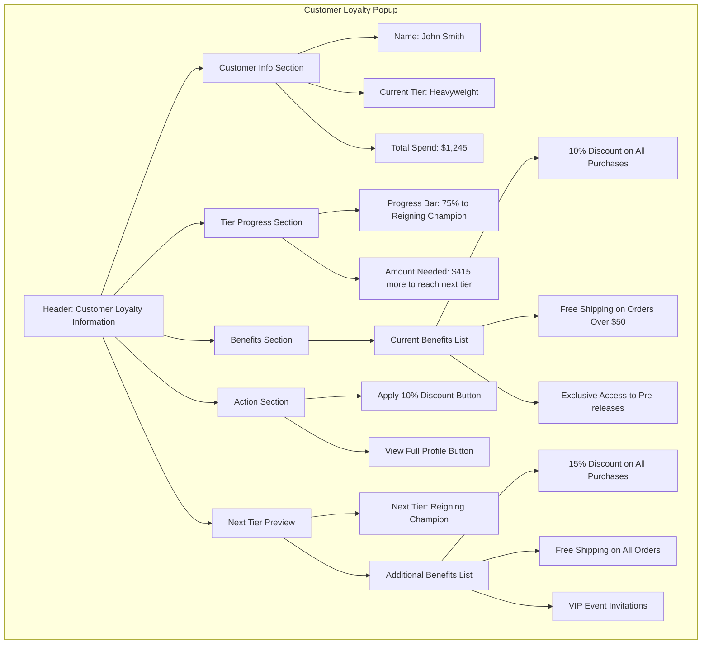

# Desktop Application Popup UI

This wireframe represents the popup interface that will appear when a customer is looked up in POS Binder or Shopify. The popup provides quick access to customer loyalty information and tier benefits.

## Key Components

1. **Customer Info Section**
   - Displays essential customer information at a glance
   - Prominently shows current tier with boxing-themed styling
   - Shows total spend to date
   - Clean, readable format for quick reference during checkout

2. **Tier Progress Section**
   - Visual progress bar showing advancement toward next tier
   - Clear indication of remaining spend needed to reach next tier
   - Percentage complete toward next tier threshold
   - Special styling when customer is close to next tier (within 5%)

3. **Benefits Section**
   - List of all benefits available at customer's current tier
   - Emphasis on benefits that can be applied to current transaction
   - Clear, concise descriptions of each benefit
   - Visual indicators for most valuable benefits

4. **Action Section**
   - Quick-access buttons for common actions
   - "Apply Discount" button for immediate application of tier discount
   - "View Full Profile" button to access complete customer details
   - Designed for efficient use during checkout process

5. **Next Tier Preview**
   - Preview of benefits at the next tier level
   - Creates incentive for customers to increase spending
   - Highlights additional benefits available at next tier
   - Provides staff with upsell conversation points

## Special Notifications

1. **Close to Next Tier Alert**
   - When customer is within 5% of reaching the next tier
   - Prominent notification with special styling
   - Suggested products or spending amounts to reach threshold
   - Example: "John is only $25 away from reaching Reigning Champion tier!"

2. **New Tier Achievement**
   - When customer has just reached a new tier
   - Celebration notification with congratulatory message
   - Overview of new benefits now available
   - Prompt for staff to highlight achievement to customer

3. **Benefit Expiration Warning**
   - If any benefits have upcoming expiration dates
   - Countdown indicator showing days remaining
   - Prompt for staff to remind customer
   - Option to extend benefit if applicable

## User Interactions

- Popup appears automatically when customer is identified in POS/Shopify
- Staff can click "Apply Discount" to automatically apply tier discount
- "View Full Profile" opens the main application to customer's detailed profile
- Popup can be minimized but remains accessible during transaction
- Popup automatically closes after transaction completion
- Staff can manually trigger popup by searching for customer

## Integration Points

1. **POS Binder Integration**
   - Listens for customer lookup events
   - Retrieves customer data based on phone number or loyalty card
   - Provides discount application functionality
   - Tracks transaction for loyalty program updates

2. **Shopify Integration**
   - Connects to Shopify admin during checkout
   - Identifies customers by email or phone
   - Provides tier information during online checkout
   - Updates loyalty data after purchase completion

## Implementation Phases

1. **Phase 1: Standalone with Mock Data**
   - Fully functional UI with placeholder data
   - Manual customer lookup functionality
   - All visual components and animations implemented
   - No actual integration with POS/Shopify

2. **Phase 2: API Integration**
   - Connect to backend API for real customer data
   - Implement authentication and data synchronization
   - Add real-time updates for customer information
   - Maintain offline functionality with local caching

3. **Phase 3: Full POS/Shopify Integration**
   - Implement direct integration with POS Binder
   - Create Shopify connection for online purchases
   - Enable automatic discount application
   - Implement real-time tier updates and notifications
